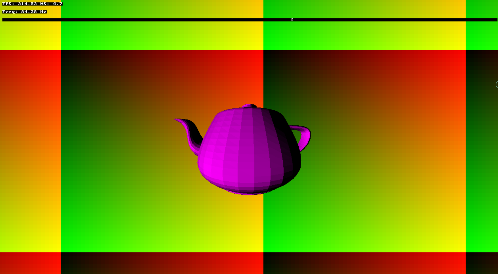

# Projet Handmade Hero & sidetrack

[Compilation des tutos "Handmade Hero" de Casey](https://youtube.com/playlist?list=PL0PAV3gVZ9gmiTxKufnvxw2-WMFHTMX6c&si=BlPUgC4mRLkqYQMA)

### prévisualisation de l'application

à noter :

### Notes : 
- Le code est entièrement fait en C. Les seules librairie utilisées sont celles du système d'exploitation (Windows)
- l'arrière plan est un tableau de couleurs sur lequel on peut "dessiner" en maintenant ctrl+click
- Attention au volumme sonore : le son est très désagréable.
- Ce n'est pas un projet "shippable", mais une démonstration de mon envie d'élargir mes compétences en programmation.
